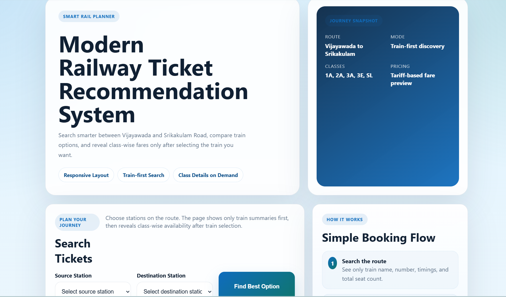

## Project Preview

# Modern Railway Ticket Recommendation System

This project is a railway ticket availability and recommendation system built using Python and Flask. It focuses on routes between Vijayawada and Srikakulam Road, displaying train details, ticket availability, and fare information.

The system analyzes station-wise availability and suggests the best possible travel options. If direct tickets are not available, it intelligently provides alternative split-journey routes to help users complete their travel.

It also considers class-wise availability and train-specific configurations while generating results, making the recommendations more realistic and structured.
