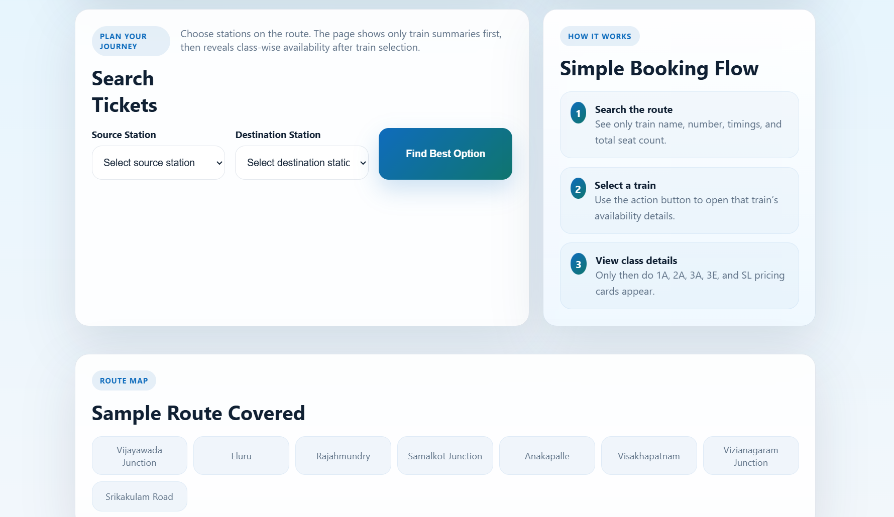

# 🚆 Modern Railway Ticket Recommendation System

## 📌 Project Overview
The **Modern Railway Ticket Recommendation System** is a smart web-based application built using **Python** and **Flask**.  
It helps users find the best possible train travel options between stations by analyzing ticket availability and suggesting optimized routes.

---

## 🖼️ Project Preview



---

## ✨ Features
- 🔍 Search trains between source and destination
- 📊 View real-time ticket availability
- 🚉 Station-wise availability analysis
- 🔁 Smart alternative route suggestions (split-journey)
- 💺 Class-wise seat availability (1A, 2A, 3A, SL, etc.)
- 💰 Fare details based on selected class
- ⚡ Fast and responsive UI

---

## 🧠 How It Works
1. User selects source and destination stations  
2. System retrieves train data  
3. Displays available trains and seat details  
4. If direct tickets are unavailable:
   - Suggests **alternative routes**
   - Combines multiple trains for completion  
5. Shows class-wise pricing and availability  

---

## 🛠️ Tech Stack
- **Backend:** Python, Flask  
- **Frontend:** HTML, CSS  
- **Logic:** Route optimization & availability analysis  

---

## 📁 Project Structure
```
├── README.md
├── project-preview.png
├── app.py
├── templates/
├── static/
```

---

## 🚀 Getting Started

### 1. Clone the repository
```bash
git clone https://github.com/your-username/Modern-Railway-Ticket-Recommendation-System.git
```

### 2. Navigate to the project folder
```bash
cd Modern-Railway-Ticket-Recommendation-System
```

### 3. Install dependencies
```bash
pip install flask
```

### 4. Run the application
```bash
python app.py
```

### 5. Open in browser
```
http://127.0.0.1:5000/
```

---

## 📌 Future Improvements
- 🔗 Integration with real-time railway APIs  
- 📱 Mobile responsive enhancements  
- 🤖 AI-based recommendation improvements  
- 💳 Online ticket booking integration  

---

## 👩‍💻 Author
**Sireesha**

---

## 📜 License
This project is licensed under the **MIT License**.
